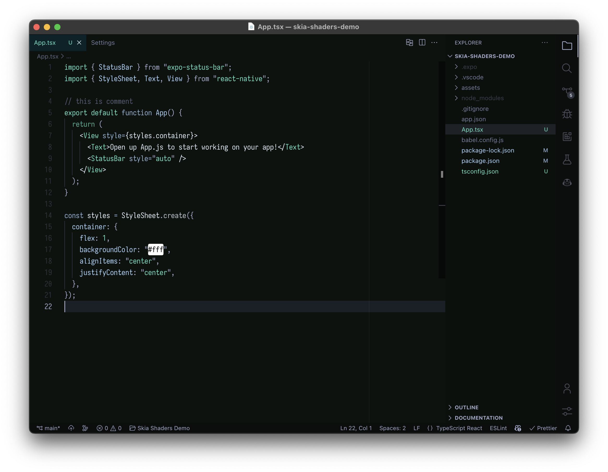

# Wildcat Theme

## Screenshot

## Installation

1. Open Extensions on the sidebar
2. Search for "wildcat"
3. Install it
4. Reload the editor
5. Press `⌘K + ⌘T`
6. Pick "wildcat" one from the list and hit enter
7. Done
